<h1 align="center">
   Hi, I'm Yunpeng 
</h1>

---

### 🚀 About Me

[Personal Website](https://zyp-up.github.io/)

- 👀 Hi, I'm Yunpeng Zhang, an AI practitioner passionate about pushing the boundaries of large model capabilities. My core work revolves around post-training of VLMs/LLMs, including SFT, RL, and data recipe design. Beyond that, I'm actively exploring AIGC, Agentic RL, and World Models — stay foolish, stay hungry.
- 🧠 I'm committed to turning research ideas into practical, reproducible engineering work. I believe AI is not a weapon to replace humanity, but a force to liberate human productivity — freeing people to pursue the higher-value endeavors that are uniquely human.
- 🤝 Open to discussion and collaboration on AI-related projects — feel free to reach out!
- 📬 Email: [yunpengZhangup@outlook.com](mailto:yunpengZhangup@outlook.com) / [yunpengzhangup@gmail.com](mailto:yunpengzhangup@gmail.com)
- 

---

<table align="center" width="100%">
  <!-- 第1行：Base Info + Achievements -->
  <tr>
    <td width="50%" align="center">
      
    </td>
    <td width="50%" align="center">
      
    </td>
  </tr>

  <!-- 第2行：Topics + Languages -->
  <tr>
    <td width="50%" align="center">
      
       
      
    </td>
    <td width="50%" align="center">
      
    </td>
  </tr>

  <!-- 第3行：日历 + 编码习惯 -->
  <tr>
    <td width="50%" align="center">
      
    </td>
    <td width="50%" align="center">
      
       
      
    </td>
  </tr>
</table>

---
