# 🎉 欢迎来到我的 GitHub 主页

  

---

## 🙋 关于我

👨‍💻 我是一名充满热情的开发者  
🌱 不断学习和探索新技术  
💡 喜欢解决有趣的问题  
📫 联系方式：[Email](mailto:yunpengZhangup@outlook.com)

---

## 🛠️ 技术栈

### 💻 编程语言

  
  
  
  
  

### 🎯 框架 & 库

  
  
  
  
  

### 🗄️ 数据库 & 工具

  
  
  
  
  

---

## 📊 GitHub Metrics（实时统计）

> 使用 [GitHub Metrics](https://github.com/lowlighter/metrics) 通过 GitHub Actions 自动生成和更新实时统计数据

### 📈 总体概览

<table align="center" width="100%">
  <tr>
    <td colspan="2" align="center">
      
    </td>
  </tr>
  <tr>
    <td width="50%" valign="top">
      
    </td>
    <td width="50%" valign="top">
      
    </td>
  </tr>
  <tr>
    <td width="50%" valign="top">
      
    </td>
    <td width="50%" valign="top">
      
    </td>
  </tr>
</table>

---

## 🌐 联系方式

  
  
  
  

---

## ⭐ 如果你喜欢我的项目，请给我一个 Star！

  Made with ❤️ by <a href="https://github.com/zyp-up">zyp-up</a>

